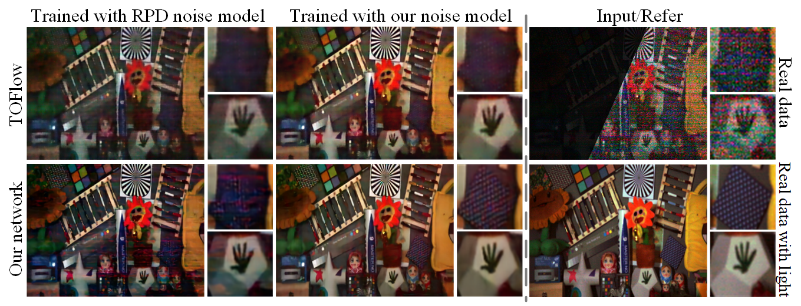

# Rebuttal Material:Enhancing Low Light Videos by Exploring High Sensitivity Camera Noise

[Flickering artifacts in the video(#R1)](#F1)

[Results  have small motion(#R1)](#R1)

[Compare with Learning to See in the Dark (#R1)](#C1)

[Compare with the model including only read noise, photon noise and dark noise (#R2)](#C2)

[Compare with the paper doing noise-to-noise (#R2)](#C22)

[Include more results on different type of camera models (#R3)](#I3)

## Flickering artifacts in the video

We thank the reviewer for pointing out this. Temporal flickering is a common problem in video processing tasks due to the instability of global optimization algorithms or highly non-linearity of deep networks. As shown, the flickering artifacts appear in the results of not only our method but also the other methods. Here, we propose to further eliminate the temporal flickering artifacts in videos with the post-processing which has been demonstrated to reduce the flickering artifacts successfully in [Learning Blind Video Temporal Consistency](<https://github.com/phoenix104104/fast_blind_video_consistency>) For fair comparison, we apply the post-processing [Learning Blind Video Temporal Consistency](<https://github.com/phoenix104104/fast_blind_video_consistency>)  in results of our method and the other methods (VBM4D and TOFlow). 

|                     VBM4D                     |                     TOFlow                     |                     Our                     |
| :-------------------------------------------: | :--------------------------------------------: | :-----------------------------------------: |
|        |        |        |
|  |  |  |

|   |        |        |
| ------------------------------------------------ | ------------------------------------------------- | ---------------------------------------------- |
|  |  |  |

|        |        |        |
| ----------------------------------------------- | ------------------------------------------------ | --------------------------------------------- |
|  |  |  |

> Fig.1 The odd-numbered rows are the results of the original algorithms(VBM4D, TOFlow, Our model). The even-numbered rows are the results of the post-processing based on the odd-numbered rows.

From Fig. 1, slight temporal flickering in  our enhancement videos can be remove via  [Learning Blind Video Temporal Consistency](<https://github.com/phoenix104104/fast_blind_video_consistency>) as post-processing. But severe temporal flickering in VBM4D and TOFlow is not obvious to be removed.

In the future work, we will explore to introduce temporal consistency loss in our network and develop an end-to-end network which could simultaneously enhance the low-light videos and reduce the flickering artifacts.

## Results  have small motion

Thanks for the suggestion. Our network could also deal with the videos with large motions, which are not shown in the supplementary material. In Fig. 2, we show more results of our method with big motions. Specifically, the ability of dealing with large motion depends on the training dataset, and we did not deliberately limit the size of the movement. Our training datasets is consist of about 900 sequences, abundant in moving scenes including small, middle and big motions. Our  training datasets is released at:   [Datasets](<https://drive.google.com/open?id=1eC18IbfVGAebJBMDJy2sTdTPjdwdZ4jd>).

|                Input                 |            Our results             |
| :----------------------------------: | :--------------------------------: |
|     |     |
|    |    |
|     |     |
|     |     |
|  |  |
|     |     |

> Fig. 2 More results of our proposed model which including abundant motion. To facilitate visualization of the original input videos, we show in the first column the brightness-scaled input videos.

## Compare with Learning to See in the Dark

Thank \#R1 for your suggestion.  In Learning to See in the Dark, due to the requirement of long exposure for capturing clean images, this method cannot be applied to the denoising of videos. Besides, the method need to take raw images captured using two cameras models (Sony $\alpha$7S 2 and Fujifilm X-T2) as input, while those camera models are unable to obtain raw data when taking videos. 

However, we are interested in comparing with this method at the same camera settings in the same low light scenario. In this rebuttal we calibrate the noise model parameters and train the network for Sony $\alpha$7S 2. Then we make comparisons with test-sony model [See-in-dark](<https://github.com/cchen156/Learning-to-See-in-the-Dark>). Through comparing with the image captured during the day, our method is demonstrated to recover higher fidelity both in color and spatial details.

> Fig. 3 Comparisons with see-in-dark at the same camera settings(ISO:128000,Exposure time:1/30) in the same low light scenario.

## Compare with the model including only read noise, photon noise and dark noise

> Fig. 4 Comparisons on the model including only read noise, photon noise , dark noise(RPD) and the proposed noise model.
>

Thank \#R2 for your suggestion. To verify the effectiveness of the proposed noise model, we train the network of [TOFlow](https://arxiv.org/abs/1711.09078) and our network model upon basic practical noise model (Eq.~1) and the proposed noise model. As show in Fig. 4, with the same network (i.e. TOFlow or our network), the results of proposed noise model are of the best quality in terms of much less chrominance artifacts, more structural details and higher contrast.

## Compare with the paper doing noise-to-noise

Thank the reviewer for this suggestion.  The noise-to-noise paper proposed to learn to turn bad images into good images by only looking at bad images, which is quite innovative and inspiring.  From the [official code](<https://github.com/NVlabs/noise2noise>) , the pre-trained networks for Poisson and Gaussian noise are used to process our low light videos(show in Fig. 5). Since the noise levels in low light videos are too high for pre-trained networks(the mean of Poisson is 50 and the standard deviation of Gaussian is 0 to 50) and only use single frame information, the results are not very good.

> Fig. 5 Comparisons with the noise-to-noise with the pre-trained network.

Then we train the noise-to-noise network with different noise models: Poisson, Gaussian and our noise model following the official guide in [Github](<https://github.com/NVlabs/noise2noise>). The noise level are chosen in comparable for fair comparison and the results are shown in Fig. 6. As compared, both method could remove a large extent of noise and recover the spatial details, while the proposed method could further remove the streak noise which could not be handled with Noise2noise. 

> Fig. 6 Comparisons with the noise-to-noise that network trained with comparable noise level and network trained with our noise model.

## Include more results on different type of camera models

We will add more results on different type of camera models in the future work and during rebuttal period we have conduct  experiments on the Sony $\alpha$7S 2 camera, and the results are shown in Fig. 3.

