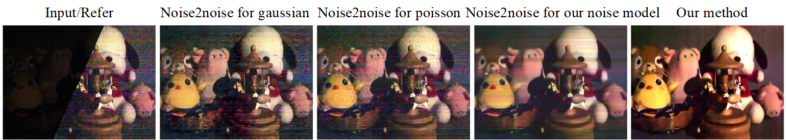

# Rebuttal Material:Enhancing Low Light Videos by Exploring High Sensitivity Camera Noise

[Flickering artifacts in the video(#R1)](#F1)

[Results  have small motion(#R1)](#R1)

[Compare with Learning to See in the Dark (#R1)](#C1)

[Compare with the model including only read noise, photon noise and dark noise (#R2)](#C2)

[Compare with the paper doing noise-to-noise (#R2)](#C22)

[Include more results on different type of camera models (#R3)](#I3)

## Flickering artifacts in the video

Thank you for the insightful questions. Temporal flickering is a common problem in many video processed tasks  due to the instability of global optimization algorithms or highly non-linear deep networks. After you point out this, we try to solve the  temporal flickering in videos. We find the algorithm  corresponding to the paper  [Learning Blind Video Temporal Consistency](<https://github.com/phoenix104104/fast_blind_video_consistency>) can be a post-processing choice for video tasks which has temporal flickering. We apply post-processing algorithm not only in results of our model but also in VBM4D and TOFlow.

​                      **VBM4D                                                     TOFlow                                                        Our**

|        |        |        |
| --------------------------------------------- | ---------------------------------------------- | ------------------------------------------- |
|  |  |  |

|   |        |        |
| ------------------------------------------------ | ------------------------------------------------- | ---------------------------------------------- |
|  |  |  |

|        |        |        |
| ----------------------------------------------- | ------------------------------------------------ | --------------------------------------------- |
|  |  |  |

> Fig.1 The odd-numbered rows are the results of the original algorithms(VBM4D, TOFlow, Our model). The even-numbered rows are the results of the post-processing based on the odd-numbered rows.

From Fig. 1, slight temporal flickering in  our enhancement videos can be remove via  [Learning Blind Video Temporal Consistency](<https://github.com/phoenix104104/fast_blind_video_consistency>) as post-processing. But severe temporal flickering in VBM4D and TOFlow is not obvious to be removed.

However,  it is not the best way to choose post-processing to remove temporal flickering. We will consider temporal consistency loss in the design and training of our network as end-to-end process in the next work.

## Results  have small motion

The confusion may come from our supplementary demo, we can show more results including big motion(Fig. 2). In fact, we did not deliberately limit the size of the movement. Our training datasets has about 900 sequences which are abundant in moving scenes including small, middle or big motion. We are willing to provide our training datasets here [Link](<https://drive.google.com/open?id=1eC18IbfVGAebJBMDJy2sTdTPjdwdZ4jd>).

|     |     |
| ------------------------------------ | ---------------------------------- |
|    |    |
|     |     |
|     |     |
|  |  |
|     |     |

> Fig. 2 More results of our proposed model which including abundant motion. To facilitate visualization of the original input videos, we show in the first column the brightness-scaled input videos.

## Compare with Learning to See in the Dark(TODO)

## Compare with the model including only read noise, photon noise and dark noise

> Fig. 3 Comparisons on the model including only read noise, photon noise , dark noise(RPD) and the proposed noise model.
>

To verify the effectiveness of the proposed noise model especially the DSN, color-channel cross-talk and clipping effect, we train the network of [TOFlow](https://arxiv.org/abs/1711.09078) and our network model upon basic practical noise model(eq. 1) and the proposed noise model. As show in Fig. 3, with the same network (i.e. TOFlow or our network), the results of proposed noise model are of the best quality in terms of much less chrominance artifacts, more structural details and higher contrast.

## Compare with the paper doing noise-to-noise

The paper "Noise2Noise: Learning Image Restoration without Clean Data" proposed to learn to turn bad images into good images by only looking at bad images, we think it is very innovative. From the [official code](<https://github.com/NVlabs/noise2noise>) , the pre-trained networks for Poisson and Gaussian noise are used to process our low light videos(show in Fig. 4). Since the noise levels in low light videos are too high for pre-trained networks(the mean of Poisson is 50 and the standard deviation of Gaussian is 0 to 50) and only use single frame information, the results are not very good.

> Fig. 4 Comparisons with the noise-to-noise with the pre-trained network.

Then we train the noise-to-noise with higher noise level(the mean of Poisson is 150 and the standard deviation of Gaussian is 100 to 150) follow the official Introductions. The results show as figure 5.

> Fig. 5 Comparisons with the noise-to-noise with higher noise level network.

## Include more results on different type of camera models(TODO)

